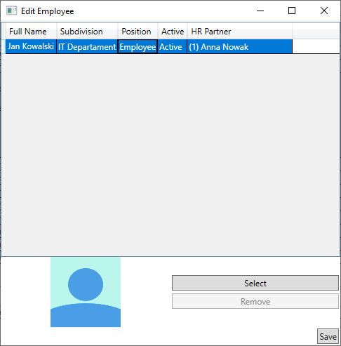

# PMan
PMan is an application for managing employees and projects.
Built using .NET 8, Windows Presentation Foundation and SQLite 3.

## Usage
Compile directly with `dotnet build` command or through the Visual Studio solution.
You can also use `dotnet run` build and launch the app.

Application uses `database.sqlite3` file located in the same folder as executable for storage.
Project includes pre-existing database file with sample data.
To use new database file remove `database.sqlite3` from output directory.

## Screenshots
#### Employee list

Ordinary employees can only see their own data.
#### Employee editor

HR Managers and Administrators can add and edit employee data.
Only Administrator can change employee's position to prevent privilege elevation.
#### Leave request list

Every employee aside from administrators can manage only their own requests.
Requests may be created, edited, submitted and canceled.
#### Leave request editor

Submitter can select from range of absence reasons and leave a comment further explaining the circumstances.
#### Approval request list

Every HR manager either accepts or rejects leave requests of employees for whom they are HR partner.
Ordinary employees can only see the requests they have submitted.
Administrator can see all requests but cannot act upon them.
#### Leave request rejection

When rejecting a leave request approver can write a comment explaining their reasoning.
#### Project list

Project managers and administrators can create and edit projects.
Ordinary employees can only see the projects which are a part of.
#### Project editor

Project managers can set project properties such as start and end date, type, select assigned members 
and leave a comment describing the project.
## Database
Data base has been created with the following SQL statements:
```
CREATE TABLE employees(
	id INTEGER PRIMARY KEY,
	full_name TEXT NOT NULL,
	subdivision INTEGER NOT NULL,
	position INTEGER NOT NULL,
	active_status INTEGER NOT NULL,
	people_partner INTEGER,
	available_days_off INTEGRER NOT NULL,
	photo_path TEXT,
	FOREIGN KEY(people_partner) REFERENCES employees(id)
);
CREATE TABLE leave_requests(
	id INTEGER PRIMARY KEY,
	employee INTEGER NOT NULL,
	absence_reason INTEGER NOT NULL,
	start_date INTEGER NOT NULL,
	end_date INTEGER NOT NULL,
	comment TEXT,
	status INTEGER NOT NULL,
	FOREIGN KEY (employee) REFERENCES employees(id)
);
CREATE TABLE approval_requests(
	id INTEGER PRIMARY KEY,
	approver INTEGER NOT NULL,
	leave_request INTEGER NOT NULL,
	comment TEXT,
	FOREIGN KEY (approver) REFERENCES employees(id),
	FOREIGN KEY (leave_request) REFERENCES leave_requests(id)
);
CREATE TABLE projects(
	id INTEGER PRIMARY KEY,
	project_type INTEGER NOT NULL,
	start_date INTEGER NOT NULL,
	end_date INTEGER,
	project_manager INTEGER NOT NULL,
	comment TEXT,
	active_status INTEGER NOT NULL,
	FOREIGN KEY (project_manager) REFERENCES employees(id)
);
CREATE TABLE project_members(
	project_id INTEGER NOT NULL,
	employee_id INTEGER NOT NULL,
	FOREIGN KEY (project_id) REFERENCES projects(id),
	FOREIGN KEY (employee_id) REFERENCES employees(id)
);
```
#### Table relations


